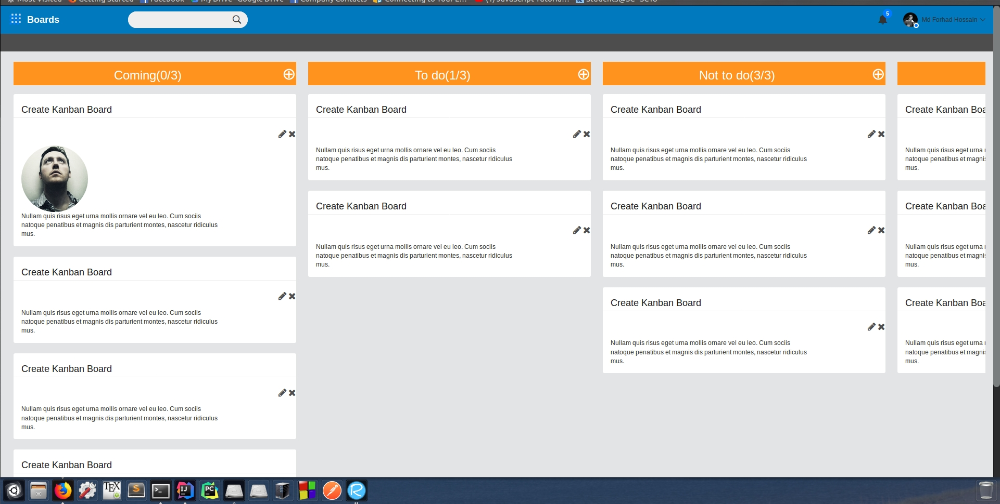
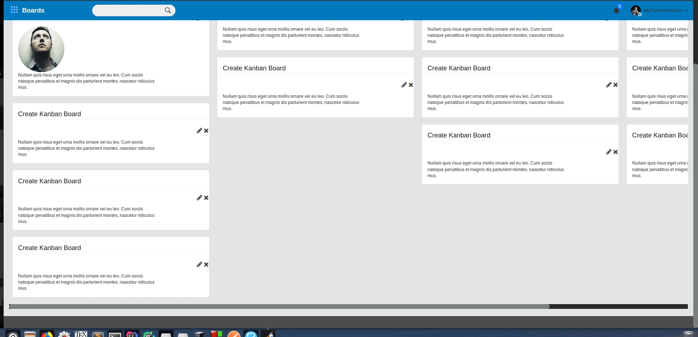

# Problem With Bootstrap-Horizon

The horizontal scroll bar does not stay on the window if the page is too long.
This can be seen on the image below.
###  The scroll bar is not on the screen.

  
 ***

### But if we scroll down to the end of the page, we can find the scroll bar.

